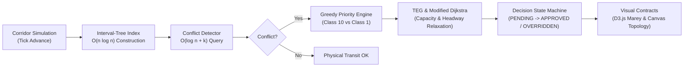

# CORTEX

> **Constraint-Optimised Real-Time Traffic EXpert**  
> *An Intelligent Real-Time Decision-Support System for Indian Railways Traffic Management using Time-Expanded Graph Search, Constraint Programming, Machine Learning, and Generative AI Explainability.*

**CORTEX** is an advisory, human-in-the-loop train traffic decision-support platform designed for Indian Railways single-track corridors. It resolves train precedence, crossing loop bottlenecks, and headway constraints by combining **Augmented Interval Trees**, **Time-Expanded Graphs (TEG)**, **Modified Dijkstra Pathfinding**, and **CP-SAT Constraint Optimization** to calculate mathematically optimal, conflict-free dispatch recommendations with natural language explainability.

---

## Architecture at a Glance



---

## Detailed Documentation Directory

All architectural design specifications, algorithms, diagrams, and API contracts are documented in the [`docs/`](docs/) directory:

| Document | Description |
|---|---|
| [**01. Architecture Overview**](docs/01_architecture_overview.md) | High-level system architecture, client-backend interaction, and core pipeline flow. |
| [**02. Domain Models & ER Schema**](docs/02_domain_and_data_models.md) | Domain entity models (`Station`, `Segment`, `CrossingLoop`, `Train`), priority classes, and SQLite database schema. |
| [**03. TEG & Modified Dijkstra**](docs/03_teg_and_dijkstra.md) | Mathematical formulation of Time-Expanded Graphs ($u=(\text{station}, \tau)$), edge capacity reservation, headway enforcement ($H_{\min}$), and priority-weighted relaxation. |
| [**04. Conflict Detection & Interval Tree**](docs/04_conflict_detection_and_interval_tree.md) | AVL Augmented Interval Tree ($O(n \log n)$ scaling), subtree `max_high` pruning, corridor spatial partitioning, and decision lifecycle state machine. |
| [**05. API Contracts Matrix**](docs/05_api_contracts_matrix.md) | Complete REST & WebSocket specification for all 13 routing endpoints, including D3.js Marey Diagram, Canvas geometry, and explainability accordions. |
| [**06. Developer Guide & Contributing**](docs/06_developer_guide_and_contributing.md) | Local environment setup, test suites, live server execution, and the standard **Branch Cut & Pull Request (PR)** engineering workflow. |

---

## Quickstart: Running Locally

### 1. Setup & Environment
```bash
cd server
python3 -m venv venv
source venv/bin/activate
cp .env.example .env
```

### 2. Run Automated Verification (All 29 Tests)
```bash
venv/bin/pytest -v
```

### 3. Start the Backend Server
```bash
venv/bin/python run.py
```
- **API Server**: [http://127.0.0.1:8000](http://127.0.0.1:8000)
- **Interactive Swagger Docs**: [http://127.0.0.1:8000/docs](http://127.0.0.1:8000/docs)

---

## Developer Git & PR Workflow

> [!IMPORTANT]
> **Always take a branch cut and open a Pull Request**. Never commit directly to `main`.

```bash
# 1. Start from updated main
git checkout main && git pull origin main

# 2. Cut a feature branch
git checkout -b feat/your-feature-name

# 3. Develop, test, and verify
venv/bin/pytest -v

# 4. Commit and push
git add .
git commit -m "feat(module): descriptive explanation of change"
git push -u origin feat/your-feature-name

# 5. Open a Pull Request for review
```
