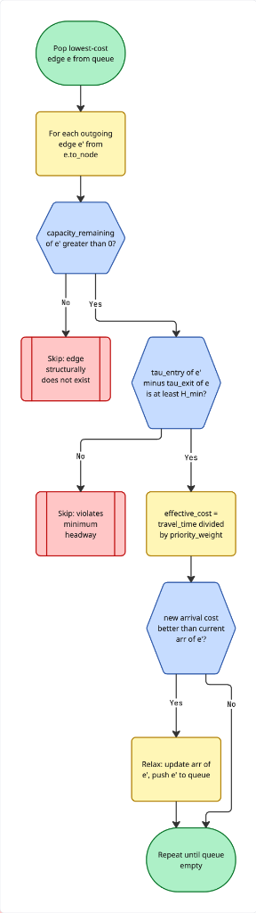
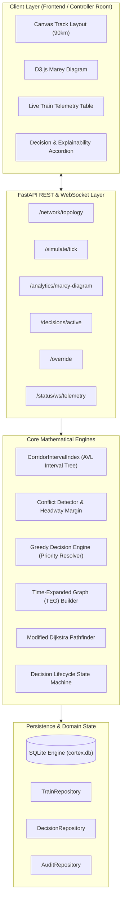

# CORTEX — Architecture Overview

## System Mission & Core Problem

**CORTEX (Constraint-Optimised Real-Time Traffic EXpert)** is an intelligent real-time decision-support system for Indian Railways traffic management using Time-Expanded Graph search, Constraint Programming, Machine Learning, and Generative AI explainability.

Single-track corridors require opposing and overtaking trains to be dynamically scheduled across physical crossing loops and station sidings. When delays occur, human controllers often face high cognitive load. CORTEX automates conflict detection, computes priority-optimal dispatch decisions, provides transparent explainability accordions, and calculates mathematical time-distance (Marey) trajectories for controller review.

---

## Architectural Flowchart

---

## High-Level Pipeline Walkthrough

1. **Physical Tick Simulation (`/simulate/tick`)**:
   - Moves active trains forward on corridor segments based on velocity ($v$) and step increments ($\Delta d$).
   - Trains flagged with `is_held=True` (e.g., waiting at Station B Crossing Loop X1) remain stationary while their `delay_minutes` counter accumulates dynamically.

2. **Temporal Conflict Detection (Interval Tree)**:
   - Train occupation windows $[t_{\text{entry}}, t_{\text{exit}})$ are indexed in a segment-partitioned **AVL Augmented Interval Tree** in $O(n \log n)$ time.
   - Overlaps and safety headway breaches ($H_{\min}$) are detected in $O(\log n + k)$ time.

3. **Priority-Weighted Decision Resolution**:
   - If a conflict occurs between two trains (e.g. Rajdhani Express vs. Goods Freight), the **Greedy Decision Engine** resolves priority based on train class weights ($10.0$ vs $1.0$).
   - The state machine immediately promotes the recommendation:
     $$\text{DETECTED} \longrightarrow \text{RECOMMENDATION} \longrightarrow \text{PENDING}$$
   - The losing train is placed on `is_held = True` at the nearest crossing loop.

4. **Time-Expanded Graph (TEG) & Modified Dijkstra Pathfinding**:
   - Evaluates alternative spatial-temporal paths across discrete $(\text{station}, \tau)$ coordinates.
   - Dijkstra relaxes candidate edges where $\text{capacity\_remaining} > 0$, penalizing travel time inversely by priority weight.

5. **Visual Client Contracts**:
   - `/network/topology`: Exposes exact pixel coordinates, track km markers, and loop capacities for Canvas rendering.
   - `/analytics/marey-diagram`: Provides exact $(x=\tau, y=\text{km})$ vertices, slope calculations, loop dwell lines, and conflict bounding boxes for D3.js.
   - `/decisions/active`: Feeds the explainability accordion (situation, decision, reasoning, expected outcome, future consequences).
