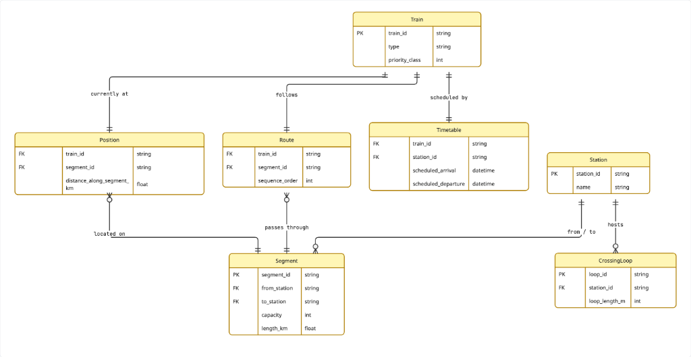
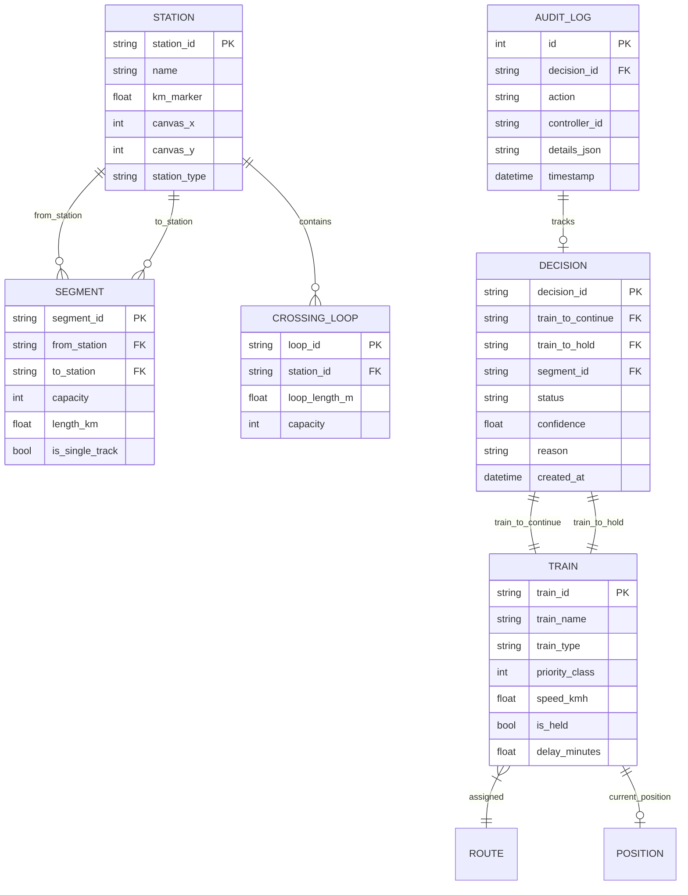

# CORTEX — Domain Models & Database Schema

## Domain Entity-Relationship Diagram

---

## Canonical MVP Topology Reference

The baseline reference world represents a canonical **90 km single-track Indian Railways corridor** with an intermediate crossing loop:

| Station ID | Name | Km Marker | Canvas $(X, Y)$ | Type | Features |
|---|---|---|---|---|---|
| `A` | Station A | $0.0\text{ km}$ | $(120, 220)$ | Major Terminal | Dual platform, yard siding |
| `B` | Station B | $50.0\text{ km}$ | $(460, 220)$ | Junction / Crossing Point | **Crossing Loop `X1`** (750m length) |
| `C` | Station C | $90.0\text{ km}$ | $(820, 220)$ | Major Terminal | Dual platform, yard siding |

### Track Segments

| Segment ID | From Station | To Station | Length | Capacity | Single Track |
|---|---|---|---|---|---|
| `S1` | `A` | `B` | $50.0\text{ km}$ | 1 | Yes (Strict block section) |
| `S2` | `B` | `C` | $40.0\text{ km}$ | 1 | Yes (Strict block section) |

---

## Train Priority Hierarchy

Priority classes are strictly defined in [`src/cortex/domain/enums.py`](file:///Users/aradhya.dev/Desktop/final-year-project/server/src/cortex/domain/enums.py):

| Train Type | Priority Class | Numerical Weight ($W$) | Effective Travel Cost Multiplier ($\frac{1}{W}$) | Dispatch Behavior |
|---|---|---|---|---|
| **Rajdhani Express (`12951`)** | `RAJDHANI` | `10.0` | $0.10$ | Highest corridor precedence; never held for lower classes |
| **Express / Passenger** | `EXPRESS` | `5.0` | $0.20$ | Intermediate precedence |
| **Goods / Freight (`G1`)** | `GOODS` | `1.0` | $1.00$ | Lowest precedence; held on crossing loop `X1` at Station B |

---

## Database Implementation (SQLite via SQLAlchemy)

- **Database Engine**: SQLite 3 file at [`server/cortex.db`](file:///Users/aradhya.dev/Desktop/final-year-project/server/cortex.db).
- **Auto-Migration**: Built-in migration inspection via `PRAGMA table_info` in [`database.py`](file:///Users/aradhya.dev/Desktop/final-year-project/server/src/cortex/infra/db/database.py) safely adds missing columns (`is_held`, `delay_minutes`, `controller_id`) without dropping existing tables or data.
- **Repositories**:
  - `TrainRepository`: CRUD + atomic bulk state updates.
  - `DecisionRepository`: Active conflict decision lookup, status mutations, and query by ID.
  - `AuditRepository`: Append-only compliance logging for controller overrides and emergency stops.
