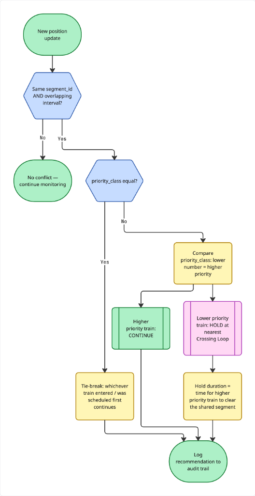
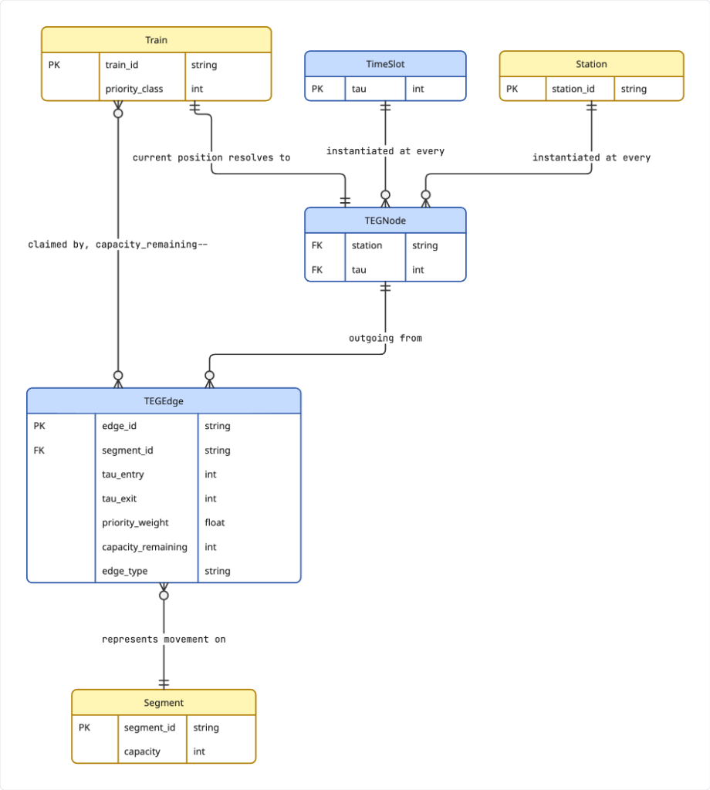
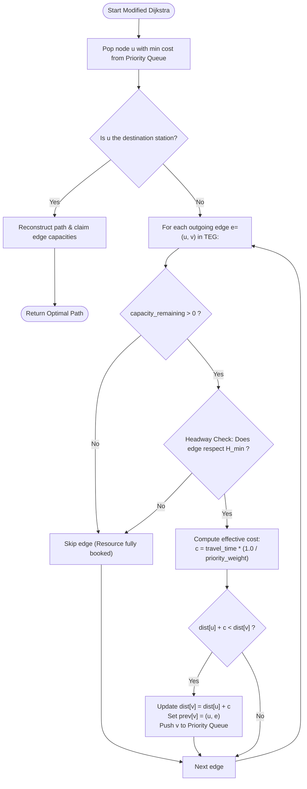

# CORTEX — Time-Expanded Graph (TEG) & Modified Dijkstra

## Mathematical Foundations

A standard static railway topology graph $G=(V, E)$ cannot capture temporal exclusivity: two trains cannot occupy the same single-track block at the same time, even though they can occupy it at different times.

To solve this, CORTEX constructs a **Time-Expanded Graph (TEG)**, expanding spatial vertices across discrete time steps $\tau \in \{0, 1, \dots, T\}$.

---

## 1. Time-Expanded Graph (TEG) Node & Edge Structure

### Nodes
A node in the TEG is defined as a tuple:
$$u = (\text{station}, \tau)$$
where:
- $\text{station} \in \{A, B, C\}$
- $\tau \in \{0, 1, \dots, T-1\}$ (where each step represents $\text{SLOT\_MINUTES}=5\text{ min}$)

For a 3-station corridor over a 10-slot horizon ($T=10$), the TEG generates exactly:
$$|V| = 3 \times 10 = 30 \text{ nodes}$$

### Edges
The TEG incorporates two distinct types of directed edges:

1. **Movement Edges**:
   Connects Station $u$ at time $\tau$ to adjacent Station $v$ at time $\tau + \Delta \tau_{\text{travel}}$:
   $$e_{\text{move}} = \Big( (u, \tau) \longrightarrow (v, \tau + \Delta \tau) \Big)$$
   - Represents physical transit along segment $S$.
   - Has initial `capacity_remaining = 1`.
   - Priority weight $W_t \in \{1.0, 5.0, 10.0\}$.

2. **Wait / Dwell Edges**:
   Connects the same station across consecutive time steps:
   $$e_{\text{wait}} = \Big( (u, \tau) \longrightarrow (u, \tau + 1) \Big)$$
   - Represents dwelling at a station platform or waiting inside Crossing Loop `X1`.
   - Capacity matches station siding or loop capacity.

---

## 2. Modified Dijkstra Relaxation Flowchart

Standard Dijkstra calculates the shortest path based purely on static edge lengths. In Cortex, the algorithm is modified to enforce capacity reservation, headway safety rules, and priority weighting:

---

## 3. Relaxation Rules

### Rule 1: Capacity Exhaustion
If another higher-priority train has already claimed an edge:
$$\text{capacity\_remaining} \le 0$$
The edge is structurally ignored during traversal.

### Rule 2: Minimum Headway Enforcement ($H_{\min}$)
To guarantee safe stopping distances between consecutive trains:
- Two trains cannot traverse consecutive movement edges into the same block without a minimum time headway separation:
$$\tau_2 \ge \tau_1 + H_{\min}$$
- Default MVP setting: $H_{\min} = 1$ time slot ($5\text{ minutes}$).

### Rule 3: Priority-Weighted Effective Cost
The cost function penalizes travel time inversely proportional to priority:
$$\text{Effective Cost}(e) = \text{travel\_time}(e) \times \left(\frac{1.0}{W_t}\right)$$

| Train Class | Weight ($W_t$) | Cost for 1-hour Transit | Cost for 1-hour Delay |
|---|---|---|---|
| **Rajdhani** | `10.0` | $6.0$ | $6.0$ |
| **Goods (Freight)** | `1.0` | $60.0$ | $60.0$ |

Because the pathfinder minimizes total cost, holding a Rajdhani for 10 minutes carries a penalty $10\times$ greater than holding a Goods freight train for 10 minutes. The solver therefore naturally schedules the Goods train to wait at Crossing Loop `X1` at Station B until Rajdhani passes.
