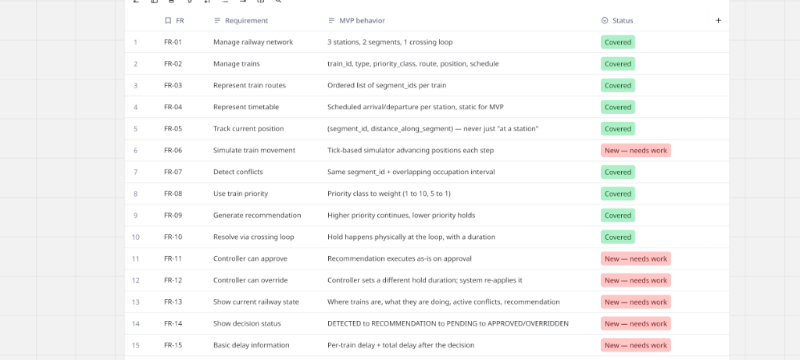
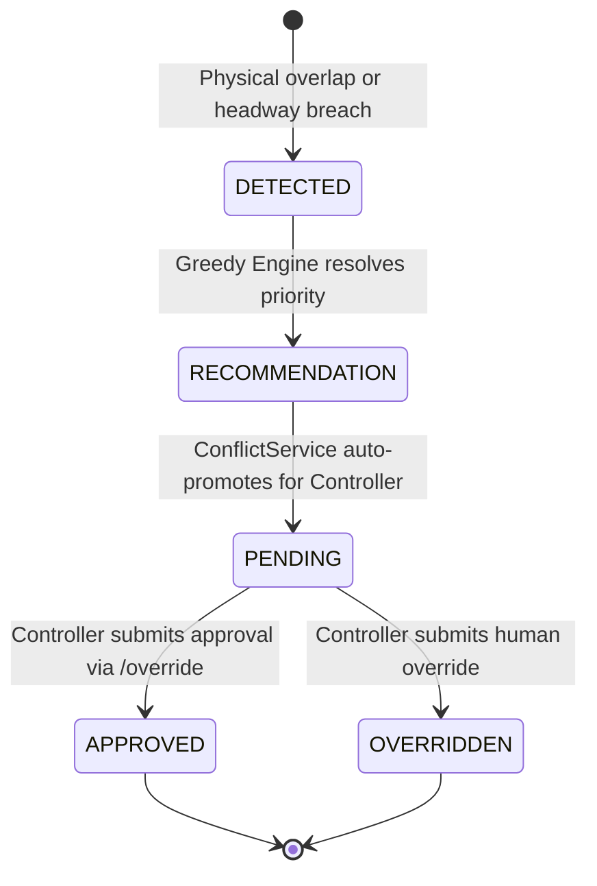

# Cortex QRTOS — Conflict Detection & Interval-Tree Scaling

## Temporal Resource Exclusivity

Railway track blocks are discrete physical resources that can only be reserved by one train at a time. A block reservation is represented as a half-open time interval:
$$I = \big[ t_{\text{entry}}, t_{\text{exit}} \big)$$

---

## Conflict Detection Lifecycle & State Machine



When an overlap occurs between two active trains on the same track segment, Cortex enforces a deterministic lifecycle:



### State Definitions & Enforced Transitions

| State | Meaning | Allowed Next State | Action Trigger |
|---|---|---|---|
| `DETECTED` | Temporal overlap detected on segment | `RECOMMENDATION` | Internal engine evaluation |
| `RECOMMENDATION` | Candidate resolution computed | `PENDING` | Promoted by application service |
| `PENDING` | Active decision awaiting controller action | `APPROVED` or `OVERRIDDEN` | Human controller decision |
| `APPROVED` | Recommendation accepted; hold enforced | Terminal | SQLite audit log written |
| `OVERRIDDEN` | Dispatcher chose custom alternative | Terminal | SQLite audit log written |

Any illegal transition (e.g. attempting to re-approve an `APPROVED` decision or overriding a nonexistent decision) strictly raises HTTP `409 Conflict`.

---

## Algorithmic Scaling: Brute Force $O(n^2)$ vs. AVL Interval Tree $O(n \log n)$

In the naive approach, every train is compared against every other train in a nested loop:
$$\text{Comparisons} = \frac{n(n-1)}{2} = O(n^2)$$

While acceptable for 2 trains, scaling to $n=50$ trains across a multi-station corridor causes rapid CPU saturation ($1225$ comparisons per simulation tick).

### Augmented AVL Interval Tree Architecture

Cortex implements an **AVL-balanced Augmented Interval Tree** in [`src/cortex/engine/conflict/interval_tree.py`](file:///Users/aradhya.dev/Desktop/final-year-project/server/src/cortex/engine/conflict/interval_tree.py):

```
                  [10:10, 10:25) | max_high=10:55
                         /               \
                        /                 \
       [10:00, 10:15) | max_high=10:15    [10:30, 10:55) | max_high=10:55
                                                  /
                                                 /
                                 [10:20, 10:35) | max_high=10:35
```

1. **Tree Invariant**: Nodes are ordered in the BST by their `entry_time` (`low`).
2. **Augmentation**: Every node maintains `max_high = \max(\text{high}, \text{left.max\_high}, \text{right.max\_high})`.
3. **Pruning Rules**:
   - **Left Subtree Pruning**: If `left.max_high <= query.entry_time - headway_margin`, no interval in the left subtree can end after query entry $\implies$ the entire left branch is skipped!
   - **Right Subtree Pruning**: If `node.low >= query.exit_time + headway_margin`, all nodes in the right subtree have $\text{low} \ge \text{query.exit} \implies$ the entire right branch is skipped!
4. **Complexity**:
   - Tree Construction: $O(n \log n)$
   - Overlap Query: $O(\log n + k)$ (where $k$ is the number of reported conflicts)

---

## Spatial Partitioning: `CorridorIntervalIndex`

A corridor consists of multiple independent track segments ($S_1, S_2$). Trains operating concurrently on *different* segments do not physically conflict.

`CorridorIntervalIndex` maintains a hash map of segment-isolated trees:
$$\text{Index} : \text{segment\_id} \longrightarrow \text{IntervalTree}$$

- When a train reserves block $S_1$, it is added strictly to the $S_1$ tree.
- Cross-segment isolation is guaranteed at zero overhead.
- Near-miss trains violating safety distance are caught via the `headway_margin` parameter.
