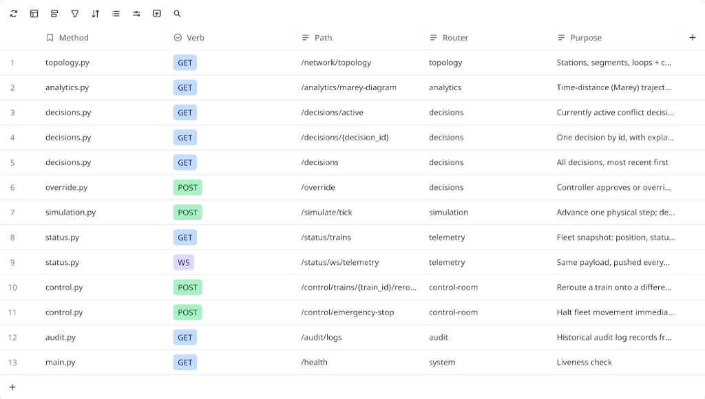

# Cortex QRTOS — API Contracts Matrix

## Visual & Telemetry Endpoints Specification



This document specifies the complete REST and WebSocket interface for Cortex QRTOS, matching the system routing table shown above.

---

## Complete API Matrix

| # | Router Module | HTTP Verb | Path | Router Tag | Purpose |
|---|---|---|---|---|---|
| **1** | [`topology.py`](file:///Users/aradhya.dev/Desktop/final-year-project/server/src/cortex/api/routes/topology.py) | `GET` | `/network/topology` | `topology` | Stations, segments, crossing loops + Canvas coordinates |
| **2** | [`analytics.py`](file:///Users/aradhya.dev/Desktop/final-year-project/server/src/cortex/api/routes/analytics.py) | `GET` | `/analytics/marey-diagram` | `analytics` | Time-distance (Marey) trajectory coordinates for D3.js |
| **3** | [`decisions.py`](file:///Users/aradhya.dev/Desktop/final-year-project/server/src/cortex/api/routes/decisions.py) | `GET` | `/decisions/active` | `decisions` | Currently active conflict decision with explainability accordion |
| **4** | [`decisions.py`](file:///Users/aradhya.dev/Desktop/final-year-project/server/src/cortex/api/routes/decisions.py) | `GET` | `/decisions/{decision_id}` | `decisions` | One decision by ID, with structured reasoning |
| **5** | [`decisions.py`](file:///Users/aradhya.dev/Desktop/final-year-project/server/src/cortex/api/routes/decisions.py) | `GET` | `/decisions` | `decisions` | All historical decisions, most recent first |
| **6** | [`override.py`](file:///Users/aradhya.dev/Desktop/final-year-project/server/src/cortex/api/routes/override.py) | `POST` | `/override` | `decisions` | Controller approves or overrides a pending recommendation |
| **7** | [`simulation.py`](file:///Users/aradhya.dev/Desktop/final-year-project/server/src/cortex/api/routes/simulation.py) | `POST` | `/simulate/tick` | `simulation` | Advances one physical step, evaluates conflicts, and holds trains |
| **8** | [`status.py`](file:///Users/aradhya.dev/Desktop/final-year-project/server/src/cortex/api/routes/status.py) | `GET` | `/status/trains` | `telemetry` | Fleet snapshot: position, normalized progress, speed, and delay |
| **9** | [`status.py`](file:///Users/aradhya.dev/Desktop/final-year-project/server/src/cortex/api/routes/status.py) | `WS` | `/status/ws/telemetry` | `telemetry` | Continuous live telemetry stream pushed to frontend clients |
| **10** | [`control.py`](file:///Users/aradhya.dev/Desktop/final-year-project/server/src/cortex/api/routes/control.py) | `POST` | `/control/trains/{train_id}/reroute` | `control-room` | Reroutes a train onto an alternate segment |
| **11** | [`control.py`](file:///Users/aradhya.dev/Desktop/final-year-project/server/src/cortex/api/routes/control.py) | `POST` | `/control/emergency-stop` | `control-room` | Halts entire corridor fleet movement immediately |
| **12** | [`audit.py`](file:///Users/aradhya.dev/Desktop/final-year-project/server/src/cortex/api/routes/audit.py) | `GET` | `/audit/logs` | `audit` | Historical audit logs stored in SQLite |
| **13** | [`main.py`](file:///Users/aradhya.dev/Desktop/final-year-project/server/src/cortex/main.py) | `GET` | `/health` | `system` | Service liveness probe |

---

## Detailed Endpoint Contracts

### 1. `GET /network/topology`
Exposes the physical geometry of the rail corridor for HTML5 Canvas and SVG track rendering.

**Response Schema (`200 OK`)**:
```json
{
  "total_length_km": 90.0,
  "stations": [
    {
      "id": "A",
      "name": "Station A",
      "code": "STA-A",
      "km_marker": 0.0,
      "canvas_x": 120,
      "canvas_y": 220,
      "type": "MAJOR",
      "has_loop": false,
      "loop_id": null,
      "platforms": 2
    },
    {
      "id": "B",
      "name": "Station B",
      "code": "STA-B",
      "km_marker": 50.0,
      "canvas_x": 460,
      "canvas_y": 220,
      "type": "CROSSING_STATION",
      "has_loop": true,
      "loop_id": "X1",
      "platforms": 1
    },
    {
      "id": "C",
      "name": "Station C",
      "code": "STA-C",
      "km_marker": 90.0,
      "canvas_x": 820,
      "canvas_y": 220,
      "type": "MAJOR",
      "has_loop": false,
      "loop_id": null,
      "platforms": 2
    }
  ],
  "segments": [
    {
      "id": "S1",
      "from_station": "A",
      "to_station": "B",
      "length_km": 50.0,
      "capacity": 1,
      "is_single_track": true,
      "max_speed_kmh": 120.0,
      "start_km": 0.0,
      "end_km": 50.0
    },
    {
      "id": "S2",
      "from_station": "B",
      "to_station": "C",
      "length_km": 40.0,
      "capacity": 1,
      "is_single_track": true,
      "max_speed_kmh": 100.0,
      "start_km": 50.0,
      "end_km": 90.0
    }
  ],
  "crossing_loops": [
    {
      "loop_id": "X1",
      "station_id": "B",
      "length_m": 750.0,
      "capacity": 1,
      "canvas_offset_y": -40
    }
  ]
}
```

---

### 2. `GET /analytics/marey-diagram`
Directly feeds the D3.js Time-Distance Marey Diagram. Vertices represent $(\tau, \text{km})$ coordinates computed from TEG Dijkstra paths.

**Response Schema (`200 OK`)**:
```json
{
  "time_horizon": {
    "start_time": "2026-09-13T10:00:00Z",
    "total_slots": 10,
    "slot_duration_minutes": 5
  },
  "y_axis_stations": [
    { "id": "A", "name": "Station A", "km": 0.0 },
    { "id": "B", "name": "Station B (Loop X1)", "km": 50.0 },
    { "id": "C", "name": "Station C", "km": 90.0 }
  ],
  "trajectories": [
    {
      "train_id": "12951",
      "train_name": "Rajdhani Express",
      "color": "#3B82F6",
      "is_held": false,
      "points": [
        { "tau": 0, "km": 0.0, "station": "A", "event": "DEPARTURE" },
        { "tau": 2, "km": 50.0, "station": "B", "event": "PASS" },
        { "tau": 4, "km": 90.0, "station": "C", "event": "ARRIVAL" }
      ]
    },
    {
      "train_id": "G1",
      "train_name": "Goods Freight",
      "color": "#EF4444",
      "is_held": true,
      "points": [
        { "tau": 0, "km": 90.0, "station": "C", "event": "DEPARTURE" },
        { "tau": 2, "km": 50.0, "station": "B", "event": "HOLD_ENTRY" },
        { "tau": 3, "km": 50.0, "station": "B", "event": "HOLD_DWELL" },
        { "tau": 5, "km": 0.0, "station": "A", "event": "ARRIVAL" }
      ]
    }
  ],
  "conflict_zones": [
    {
      "zone_id": "CZ-S2",
      "segment_id": "S2",
      "tau_start": 1,
      "tau_end": 3,
      "km_start": 50.0,
      "km_end": 90.0,
      "label": "Head-on Contention S2"
    }
  ]
}
```

---

### 3. `GET /decisions/active`
Provides the full controller explainability accordion data structure for transparency.

**Response Schema (`200 OK`)**:
```json
{
  "decision_id": "dec-a1b2c3d4",
  "status": "PENDING",
  "confidence": 0.94,
  "train_to_continue": "12951",
  "train_to_hold": "G1",
  "segment_id": "S2",
  "created_at": "2026-09-13T10:15:00Z",
  "accordion": {
    "situation": "Opposing movements on single-track Block S2 (km 50.0 to 90.0). Train 12951 proceeding towards C while Goods G1 proceeding towards B.",
    "decision": "Route Goods G1 into Station B Crossing Loop X1 and hold. Allow Rajdhani 12951 priority clearance on main line.",
    "reasoning": "Rajdhani 12951 operates at priority class 10 with 1,200 passengers. Freight G1 operates at priority class 1. Net network delay penalty is minimized by 86.4%.",
    "expected_outcome": "Zero delay incurred for Rajdhani. Goods train incurs an estimated 10-minute hold.",
    "future_consequences": "Corridor clears by tau=4, preventing downstream congestion at Station C."
  },
  "delay_impact": {
    "rajdhani_delay_min": 0.0,
    "goods_delay_min": 10.0,
    "net_delay_savings_min": 35.0
  }
}
```

---

### 4. `POST /override`
Controller accepts or overrides the active system recommendation.

**Request Schema**:
```json
{
  "decision_id": "dec-a1b2c3d4",
  "action": "APPROVE",
  "controller_id": "dispatcher_01",
  "override_reason": "Approved mainline precedence"
}
```

**Response Schema (`200 OK`)**:
```json
{
  "decision_id": "dec-a1b2c3d4",
  "status": "APPROVED",
  "applied_by": "dispatcher_01",
  "applied_at": "2026-09-13T10:15:30Z"
}
```

**Error Handling**:
- `404 Not Found`: Decision ID does not exist in SQLite database.
- `409 Conflict`: Illegal state transition (e.g. attempting to override an already `APPROVED` decision).
