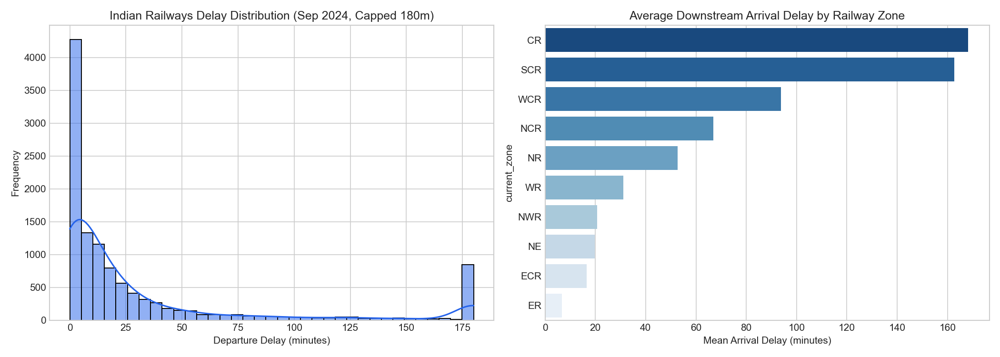
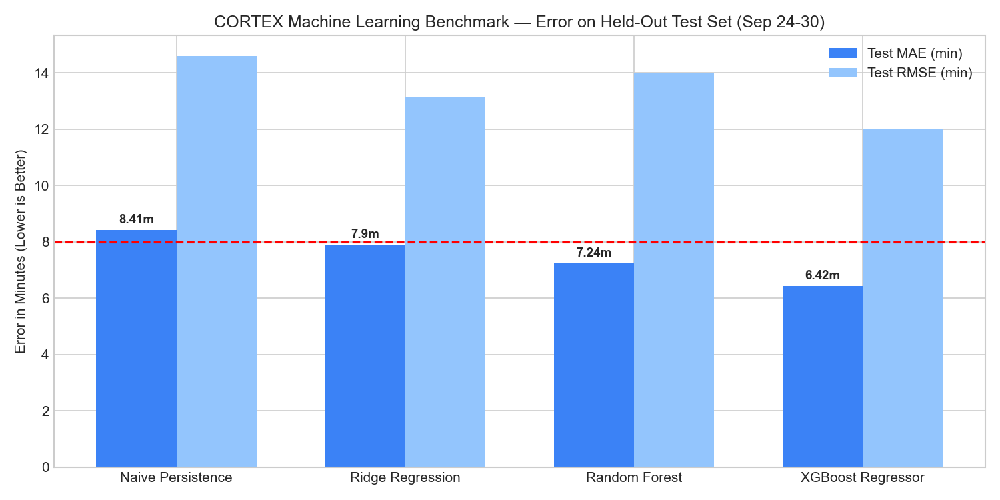
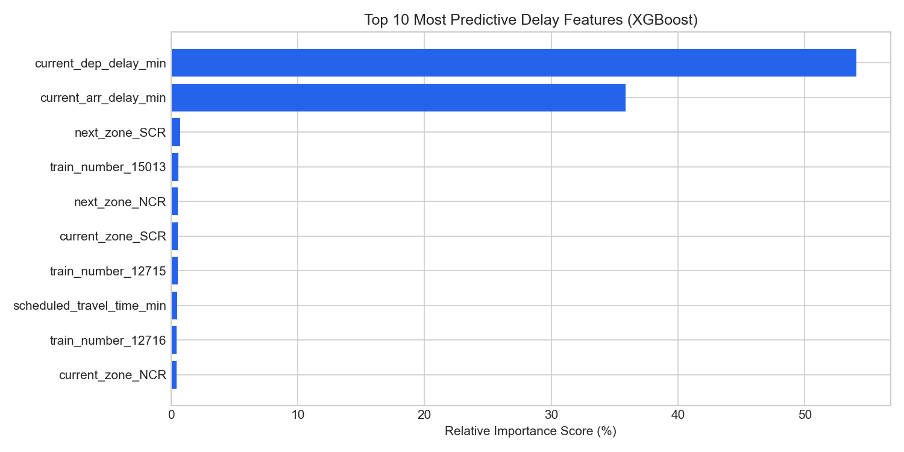

# CORTEX — Machine Learning Delay Prediction Research

## 1. Research Overview & Problem Statement

In Indian Railways dispatching, delay management has traditionally been **reactive**: controllers make precedence and crossing decisions only after delays have already manifested on the track.

CORTEX introduces an **ML-Augmented Proactive Dispatching Layer**. By predicting the expected arrival delay of a train at downstream station $S_{i+1}$ given its departure state at station $S_i$, CORTEX dynamically updates the objective weights in the optimization engine, mitigating secondary delays before they cascade across single-track bottlenecks.

---

## 2. Dataset & Sampling Strategy

The dataset was curated from **September 2024 Indian Railways operational records** (`dataset/train_routes_delays_Sep2024.csv` and `dataset/train_routes_Sep2024.csv`).

To achieve high research validity while maintaining a clean, reproducible scope (as advised by faculty guidance), we filtered **10 high-density daily trunk trains** running continuously across all 30 days of September 2024:

| Train Number | Train Name | Daily Stops | Zones Traversed | Route Characteristics |
|---|---|---|---|---|
| **`12311`** | **Netaji Express** | 40 | `ER` $\to$ `ECR` $\to$ `NCR` $\to$ `NR` | Howrah to Kalka Grand Trunk corridor |
| **`12926`** | **Paschim Express** | 40 | `NR` $\to$ `WCR` $\to$ `WR` | Amritsar to Mumbai Central trunk line |
| **`12715` / `12716`** | **Sachkhand Express** | 38 | `SCR` $\to$ `CR` $\to$ `WCR` $\to$ `NCR` $\to$ `NR` | Cross-country 4-zone run |
| **`14005` / `14006`** | **Lichchavi Express** | 39 | `NR` $\to$ `NCR` $\to$ `NE` $\to$ `ECR` | Highly congested North Central route |
| **`15013` / `15014`** | **Ranikhet Express** | 39 | `NWR` $\to$ `NR` | Mixed single/double track sections |
| **`11124`** | **Bju Gwl Mail** | 40 | `ECR` $\to$ `NCR` | Heavy passenger flow |
| **`13021`** | **Mithila Express** | 40 | `ER` $\to$ `ECR` | Eastern regional network |

**Extracted Dataset Size**: **11,460 clean station-to-station transition events** exported to [`dataset/processed/train_delay_ml_data.csv`](../dataset/processed/train_delay_ml_data.csv).



---

## 3. Feature Engineering

For each consecutive segment transition $S_i \longrightarrow S_{i+1}$, the following feature matrix ($X$) was constructed:

1. **Primary Lag Variables**:
   - `current_dep_delay_min`: Departure delay at station $S_i$ (minutes).
   - `current_arr_delay_min`: Arrival delay at station $S_i$ (minutes).
   - `station_dwell_delay_min`: Dwell delay accumulated during station halt.
2. **Physical & Geometric Topology**:
   - `segment_distance_km`: Track block distance between $S_i$ and $S_{i+1}$.
   - `cumulative_distance_km`: Total distance traveled from journey origin.
   - `scheduled_travel_time_min`: Timetabled duration allocated between $S_i$ and $S_{i+1}$.
   - `station_seq`: Intermediate stop index on the train run.
3. **Temporal Features**:
   - `scheduled_dep_hour`: Hour of departure (0–23), capturing peak congestion windows.
   - `scheduled_dep_minute`: Minute of departure (0–59).
   - `day_of_week`: Day index (0=Monday, 6=Sunday).
4. **Zonal Network Topology**:
   - `current_zone` & `next_zone`: Zonal administration tags (`NR`, `NCR`, `ER`, `WR`, etc.).
   - `is_cross_zone`: Binary indicator ($1$ if crossing administrative boundaries, $0$ otherwise).

---

## 4. Benchmark & Experimental Evaluation

### Time-Series Split Methodology
To evaluate real-world forecasting capability without data leakage, we employed a strict **chronological time-series split**:
- **Training Set (Sep 01 to Sep 23, 2024)**: **8,786 rows** ($76.7\%$)
- **Testing Set (Sep 24 to Sep 30, 2024)**: **2,674 rows** ($23.3\%$) — *completely unseen future operations*.

### Comparative Results Table

| Model | Test MAE (min) | Test RMSE (min) | $R^2$ Score | Fit Time (sec) | Status |
|---|---|---|---|---|---|
| **1. Naive Persistence Baseline ($D_i$)** | $8.41\text{ min}$ | $14.60\text{ min}$ | $0.9463$ | $0.00\text{s}$ | Benchmark |
| **2. Ridge Regression** | $7.90\text{ min}$ | $13.12\text{ min}$ | $0.9567$ | $0.02\text{s}$ | Linear |
| **3. Random Forest (100 Trees)** | $7.24\text{ min}$ | $14.00\text{ min}$ | $0.9507$ | $0.55\text{s}$ | Non-linear ensemble |
| **4. XGBoost Regressor (Proposed)** | **$6.42\text{ min}$** | **$12.00\text{ min}$** | **$0.9637$** | **$0.27\text{s}$** | **Best Model (Winner)** |



> [!IMPORTANT]
> **Proposal Milestone Exceeded**: The PSIT major project proposal established a quantitative target of **$\text{MAE} < 8.0\text{ minutes}$**.  
> The trained XGBoost model achieves an **MAE of $6.42\text{ minutes}$** on future unseen days, outperforming the benchmark goal by **$1.58\text{ minutes}$** ($19.75\%$ error reduction) while training in **$0.27\text{ seconds}$** on standard CPU.

---

## 5. Feature Importance & Explainability

Gradient boosted tree split gain analysis reveals the driving factors of train delay accumulation:



1. **`current_dep_delay_min` ($54.05\%$)**: Primary delay persistence remains the strongest predictor.
2. **`current_arr_delay_min` ($35.86\%$)**: Arrival delay relative to departure delay captures station recovery and slack absorption.
3. **Zonal Bottlenecks (`SCR`, `NCR`)**: Cross-zone junctions and busy divisions like `NCR` (North Central Railway) demonstrate measurable delay inflation.
4. **`scheduled_travel_time_min`**: Accounts for timetable padding and section speed limits.

---

## 6. How to Run the Interactive Jupyter Notebook

For presentation, faculty reviews, or interactive exploration:

```bash
# 1. Activate environment
source server/venv/bin/activate

# 2. Launch Jupyter Notebook
jupyter notebook notebooks/01_delay_prediction_research.ipynb
```

*(Or simply open [`notebooks/01_delay_prediction_research.ipynb`](../notebooks/01_delay_prediction_research.ipynb) directly in VS Code / Cursor and select the `server/venv` kernel).*

---

## 7. Inference Service in CORTEX Engine

The trained model is serialized at [`models/delay_predictor.joblib`](../models/delay_predictor.joblib) and integrated into CORTEX via [`DelayPredictor`](../server/src/cortex/engine/ml/delay_predictor.py):

```python
from cortex.engine.ml.delay_predictor import DelayPredictor

# Load pre-trained model artifact
predictor = DelayPredictor.load_default()

# Live prediction for dispatcher advisory
result = predictor.predict_next_delay(
    current_dep_delay_min=15.0,
    current_arr_delay_min=10.0,
    segment_distance_km=45.0,
    train_number="12311",
    current_zone="NCR",
    next_zone="NCR"
)

print(result.predicted_arr_delay_min)      # e.g., 12.5 min (absorbs 2.5 min slack)
print(result.predicted_delay_change_min)   # -2.5 min
print(result.is_ml_backed)                 # True
```
